# Flexbox Defender / Flexbox Exercises
URL: `http://www.flexboxdefense.com/`.

### NIVEL 1 ###

Your job is to stop the incoming enemies from getting past your defenses. Unlike other tower defense games, you must position your towers using CSS!

We'll start with container properties. A flexbox container has a main axis and a cross axis.

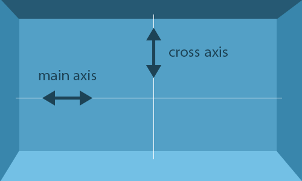

Use the `justify-content` property on the tower group container to move your towers into effective positions. `justify-content` positions a container's items along the main axis and accepts the following values:

`flex-start`: group items at the start of a container's main axis
`flex-end`: group items at the end of the main axis
`center`: group items in the center of the main axis
`space-between`: evenly distribute items along the main axis such that the first item aligns at the start and the final item aligns at the end
`space-around`: evenly distribute items along the main axis such that all items have equal space around them

------------------------

Use the `justify-content` property to move these two towers into position. Click the  button in the stylesheet for a reminder on how the property works.

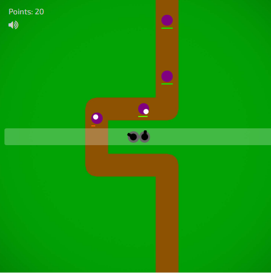

```css
.tower-group-1 {
  display: flex;
  justify-content: center;
}
```
### NIVEL 2 ###

Use `justify-content` to move the towers into position. `justify-content` accepts the following values:

`flex-start`: group items at the start of a container's main axis
`flex-end`: group items at the end of the main axis
`center`: group items in the center of the main axis
`space-between`: evenly distribute items along the main axis such that the first item aligns at the start and the final item aligns at the end
`space-around`: evenly distribute items along the main axis such that all items have equal space around them

------------------------

Use the `justify-content` property to move these two towers into position.

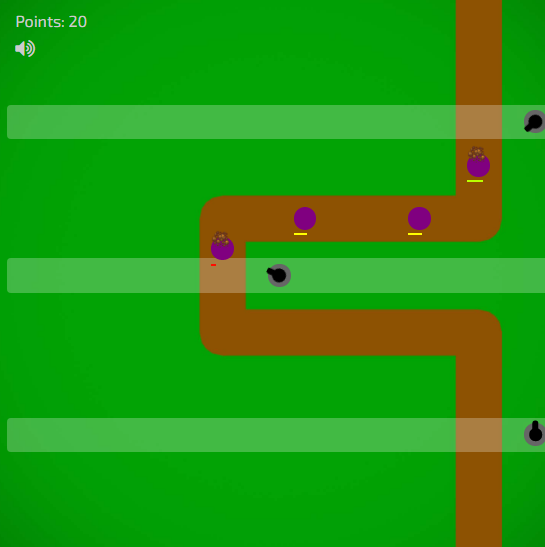

```css
.tower-group-1 {
  display: flex;
  justify-content: flex-end;
}

.tower-group-2 {
  display: flex;
  justify-content: center;
}

.tower-group-3 {
  display: flex;
  justify-content: flex-end;
}
```

### NIVEL 3 ###

Use `justify-content` to move the towers into position. `justify-content` accepts the following values:

`flex-start`: group items at the start of a container's main axis
`flex-end`: group items at the end of the main axis
`center`: group items in the center of the main axis
`space-between`: evenly distribute items along the main axis such that the first item aligns at the start and the final item aligns at the end
`space-around`: evenly distribute items along the main axis such that all items have equal space around them

------------------------

Use the `justify-content` property to move your towers.

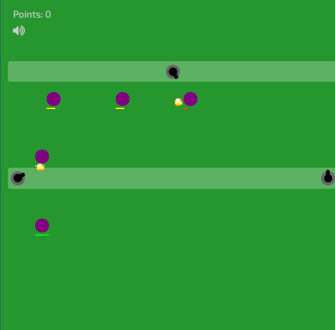

```css
.tower-group-1 {
  display: flex;
  justify-content: center;
}

.tower-group-2 {
  display: flex;
  justify-content: space-between;
}
```

### NIVEL 4 ###

Now some of the groups have vertical space, which is the perfect opportunity to use the `align-items` property. `align-items` positions a container's items across its cross axis and accepts the following values:

`flex-start`: align items across the start of a container's cross axis
`flex-end`: align items across the end of the cross axis
`center`: align items across the center of the cross axis

Note: `align-items` also accepts the values baseline (align items such that their baselines line up) and stretch (stretch items such that they span the entire cross axis), but these values cannot be used in Flexbox Defense.

------------------------

Use `align-items` to move your towers into effective positions.

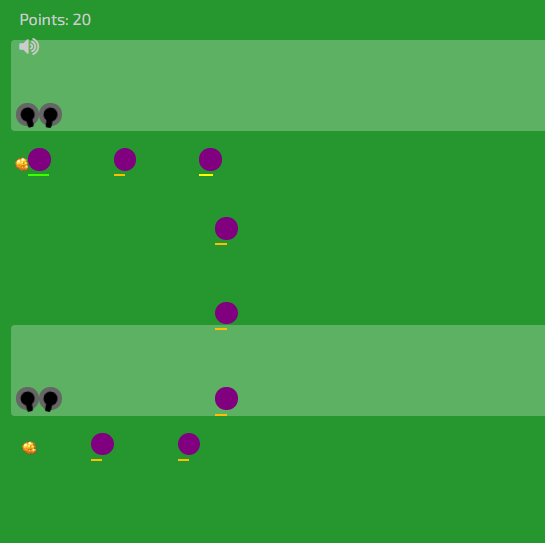

```css
.tower-group-1 {
  display: flex;
  align-items: flex-end;
}

.tower-group-2 {
  display: flex;
  align-items: flex-end;
}
```

### NIVEL 5 ###

This time things are a bit trickier. Try combining `justify-content` and `align-items` to score 80 or higher!

`justify-content`

`flex-start`: group items at the start of a container's main axis
`flex-end`: group items at the end of the main axis
`center`: group items in the center of the main axis
`space-between`: evenly distribute items along the main axis such that the first item aligns at the start and the final item aligns at the end
`space-around`: evenly distribute items along the main axis such that all items have equal space around them

`align-items`

`flex-start`: align items across the start of a container's cross axis
`flex-end`: align items across the end of the cross axis
`center`: align items across the center of the cross axis

------------------------

  Use `justify-content` and `align-items` to move your towers into position.

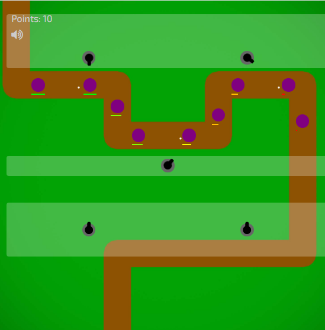

```css
.tower-group-1 {
  display: flex;
  justify-content: space-around;
  align-items: flex-end;
}

.tower-group-2 {
  display: flex;
  justify-content: center;
  align-items: center;
}

.tower-group-3 {
  display: flex;
  justify-content: space-around;
  align-items: center;
}
```

### NIVEL 6 ###

This time things are a bit trickier. Try combining `justify-content` and `align-items` to score 80 or higher!

`justify-content`

`flex-start`: group items at the start of a container's main axis
`flex-end`: group items at the end of the main axis
`center`: group items in the center of the main axis
`space-between`: evenly distribute items along the main axis such that the first item aligns at the start and the final item aligns at the end
`space-around`: evenly distribute items along the main axis such that all items have equal space around them

`align-items`

`flex-start`: align items across the start of a container's cross axis
`flex-end`: align items across the end of the cross axis
`center`: align items across the center of the cross axis

------------------------

  Use `justify-content` and `align-items` to move your towers into position.

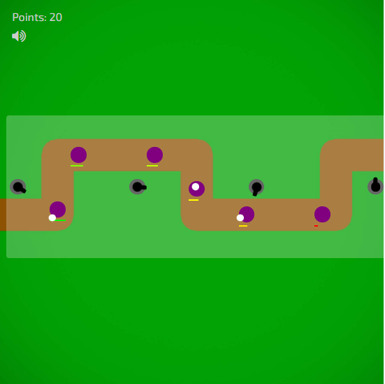

```css
.tower-group-1 {
  display: flex;
  justify-content: space-between;
  align-items: center;
}
```

### NIVEL 7 ###

This time you have more towers, but less horizontal room to work with.

The `flex-direction` property is your answer. `flex-direction` defines the directional layout of the main and cross axes in the flex container.

For example, although the main axis lays out horizontally and the cross axis lays out vertically by default, `flex-direction` can rotate the axes such that the main axis lays out vertically and the cross axis lays out horizontally. Here's what this looks like:

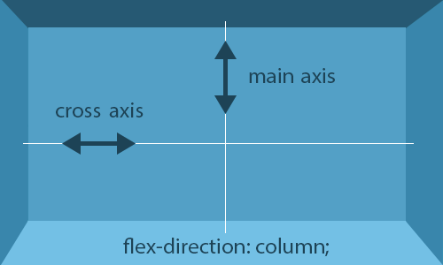

Accordingly, `flex-direction` accepts the following values:

`row`: lay out the main axis from left to right
`row-reverse`: lay out the main axis from right to left
`column`: lay out the main axis from top to bottom
`column-reverse`: lay out the main axis from bottom to top

------------------------

Use `flex-direction` to move your towers into position.

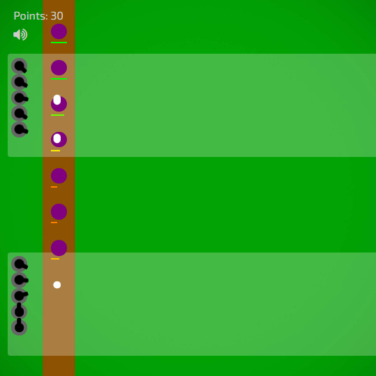

```css
.tower-group-1 {
  display: flex;
  flex-direction: column;
}

.tower-group-2 {
  display: flex;
  flex-direction: column;
}
```

### NIVEL 8 ###

Now `flex-direction` must be combined with a property you've learned previously. You'll be responsible for determining which one! Remember: `flex-direction` can change the directional layout of the axes.

`flex-direction`

`row`: lay out the main axis from left to right
`row-reverse`: lay out the main axis from right to left
`column`: lay out the main axis from top to bottom
`column-reverse`: lay out the main axis from bottom to top

`justify-content`

`flex-start`: group items at the start of a container's main axis
`flex-end`: group items at the end of the main axis
`center`: group items in the center of the main axis
`space-between`: evenly distribute items along the main axis such that the first item aligns at the start and the final item aligns at the end
`space-around`: evenly distribute items along the main axis such that all items have equal space around them

`align-items`

`flex-start`: align items across the start of a container's cross axis
`flex-end`: align items across the end of the cross axis
`center`: align items across the center of the cross axis

------------------------

Use `flex-direction` and either `justify-content` or `align-items` to move your towers into position.

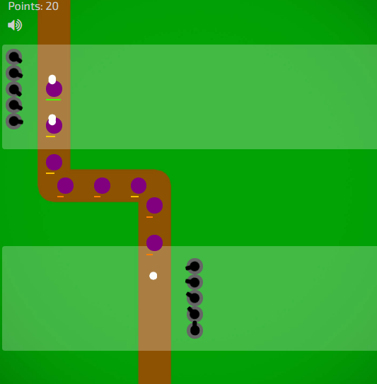

```css
.tower-group-1 {
  display: flex;
  justify-content: flex-start;
  flex-direction: column;
  align-items: flex-start;
}

.tower-group-2 {
  display: flex;
  justify-content: center;
  flex-direction: column;
  align-items: center;
}
```

### NIVEL 9 ###

Now `flex-direction` must be combined with a property you've learned previously. You'll be responsible for determining which one! Remember: `flex-direction` can change the directional layout of the axes.

`flex-direction`

`row`: lay out the main axis from left to right
`row-reverse`: lay out the main axis from right to left
`column`: lay out the main axis from top to bottom
`column-reverse`: lay out the main axis from bottom to top

`justify-content`

`flex-start`: group items at the start of a container's main axis
`flex-end`: group items at the end of the main axis
`center`: group items in the center of the main axis
`space-between`: evenly distribute items along the main axis such that the first item aligns at the start and the final item aligns at the end
`space-around`: evenly distribute items along the main axis such that all items have equal space around them

`align-items`

`flex-start`: align items across the start of a container's cross axis
`flex-end`: align items across the end of the cross axis
`center`: align items across the center of the cross axis

------------------------

Use `flex-direction` and either `justify-content` or `align-items` to move your towers into position.

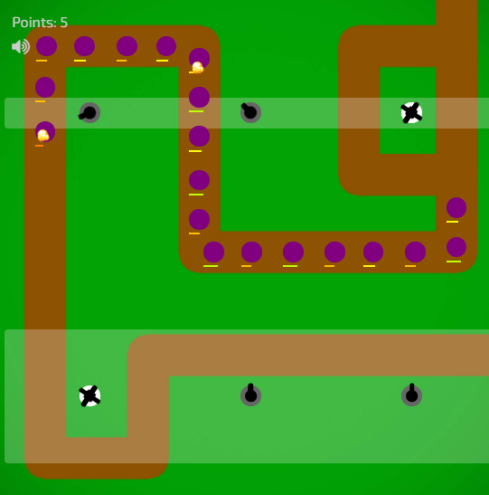

```css
.tower-group-1 {
  display: flex;
  flex-direction: row-reverse;
  justify-content: space-around;
}

.tower-group-2 {
  display: flex;
  align-items: center;
  flex-direction: row-reverse;
  justify-content: space-around;
}
```